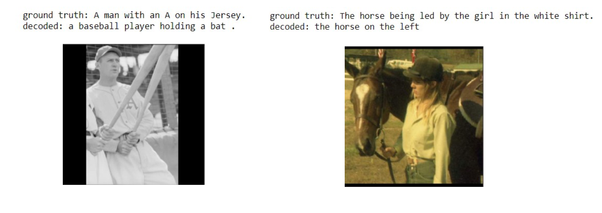
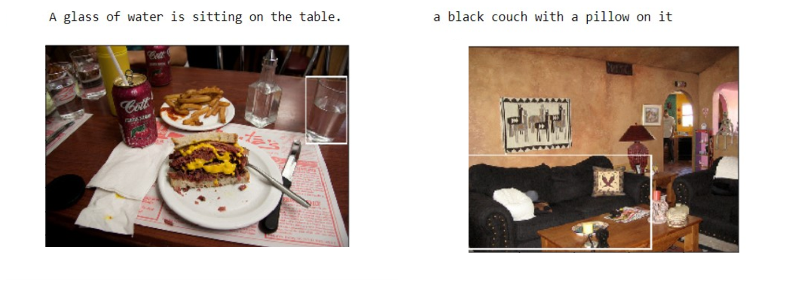

# Brief
In this repo, I have provided the solution to my Deep Learning course project. The project was about Image Captioning and Image Comprehension/ (similar to [this paper](https://arxiv.org/abs/1511.02283)). The network architecture is like the following image:

# Image Comprehension
Some of my results:

# Image Captioning
In this part, the model is expected to locate a specific object given its description:

